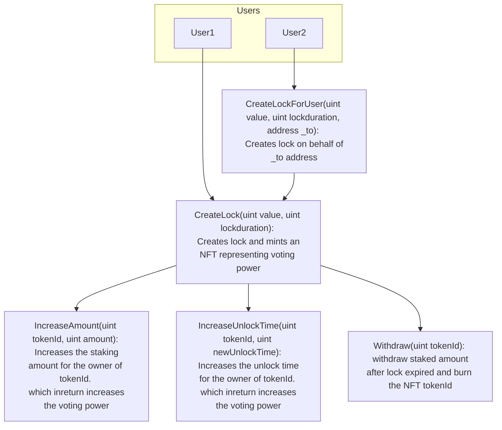

# User Flow



<br><br>

## Test Coverage report:

Pre-requisite:

- genhtml
- lcov

To access the test coverage report, run the command

```console
forge coverage --report lcov && genhtml lcov.info --branch-coverage --output-dir coverage --ignore-errors category
```

Now, access the coverage/index.html file to access the detailed reports
